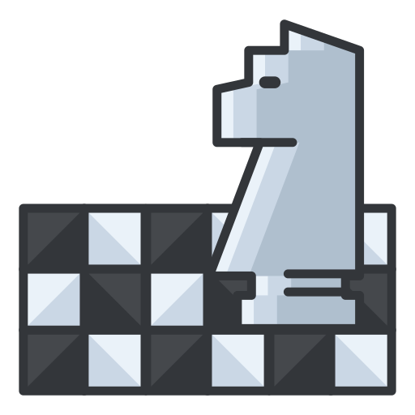

# Chess



A polished, WinForms-based chess application written in C# (.NET Framework 4.7.2). This project includes a user/login UI, timed games, move history, piece promotion, sound effects and resource images for pieces and UI icons.

## Highlights

- Built with Windows Forms (WinForms) targeting .NET Framework 4.7.2.
- Login / signup screens (runs `UserForm` by default).
- Timed matches with visual low-time warning and sound effects.
- Move list/history panel, restart and play controls.
- Pawn promotion via `PromotingForm` and end-of-game dialogs.
- All piece images and UI assets stored in `src/resurse/`.

> Quick note: I inspected `Program.cs` and the project file to gather details. The app starts in `UserForm` (so it presents a login/user screen before the game).

## Screenshot

If you'd like to include screenshots, add them to the repository (for example `src/resurse/ChessImg.png`) and then reference them here. Example:


## Requirements

- Windows 7 / 8 / 10 / 11
- Visual Studio 2017 or later (or any IDE that supports .NET Framework WinForms projects)
- .NET Framework 4.7.2

## Open & Build

1. Open `src/Chess.csproj` with Visual Studio.
2. Build (Ctrl+Shift+B) and run (F5).

Alternatively, from PowerShell you can build with msbuild (Visual Studio Developer Command Prompt or any environment where `msbuild` is available):

```powershell
msbuild src\Chess.csproj /p:Configuration=Debug
```

Then run the produced executable in `bin\Debug\`.

## How to Play

1. Launch the app — you'll first see the user/login screen.
2. Log in or sign up using the builtin forms.
3. Choose a time control from the dropdown and click Play.
4. Use the GUI to move pieces. The move list panel shows history.
5. When a pawn reaches the final rank, the promotion dialog will appear.

## Project layout

- `src/` — main source files and forms
  - `Cell.cs`, `ChessBoard.cs`, `ChessForm.cs` — game UI & board logic
  - `Pieces/` — piece classes (King, Queen, Rook, Bishop, Knight, Pawn, Piece)
  - `UserForm.*`, `SignUpForm.*`, `ForgotPassForm.*` — user management forms
  - `PromotingForm.*`, `GameEndForm.*` — promotion and end-of-game dialogs
- `resurse/` — assets (piece images, icons, sound files referenced by the app)

## Notes & Assumptions

- I confirmed the app's entry point is `Program.Main()` which runs `UserForm`.
- The project references several local resource files in `resurse/` such as piece images and sound effects.
- I assumed the repository currently doesn't include an explicit LICENSE file — if you want an open source license, add a `LICENSE` (MIT, Apache-2.0, etc.) and I can add a badge and license section.

## Contribution

If you'd like contributions from others, consider adding:

- a `CONTRIBUTING.md` with guidelines,
- `LICENSE` to declare how the project may be used,
- simple issues to track features (UI polish, AI opponent, online play).

Small ideas to improve README further (I can add these for you):

- Add screenshots / demo GIF.
- Add a short recorded demo or link to a video.
- Add a development section with unit-test guidance (if tests get added).

## Contact & Credits

Created by the repository owner. For questions about implementation details, open an issue or drop a note in the repository.

---

If you'd like I can:

1. Add a screenshot and wire it into this README (you can upload one or I can generate a placeholder),
2. Add a license (MIT recommended) and a build badge,
3. Generate a short `CONTRIBUTING.md` template.

Tell me which of these you'd like next and I'll apply it.
